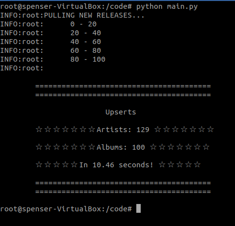

<!-- PROJECT LOGO -->
<br />
<p align="center">
  <a href="https://github.com/92swhite/spotify-api-scraper">
    
  </a>

  <h3 align="center">Spotify API scraper example</h3>

  <p align="center">
    Plus kafka too!
    <br />
    <a href="https://developer.spotify.com/documentation/"><strong>Explore the docs »</strong></a>
    <br />
    <br />
    <a href="https://wiki.teamfortress.com/wiki/Demoman">View Demo</a>
    ·
    <a href="https://github.com/92swhite/spotify-api-scraper/issues">Report Bug</a>
    ·
    <a href="https://github.com/92swhite/spotify-api-scraper/issues">Request Feature</a>
  </p>
</p>

<!-- TABLE OF CONTENTS -->
<details open="open">
  <summary>Table of Contents</summary>
  <ol>
    <li>
      <a href="#about-the-project">About The Project</a>
      <ul>
        <li><a href="#built-with">Built With</a></li>
      </ul>
    </li>
    <li>
      <a href="#getting-started">Getting Started</a>
      <ul>
        <li><a href="#prerequisites">Prerequisites</a></li>
        <li><a href="#installation">Installation</a></li>
      </ul>
    </li>
    <li><a href="#usage">Usage</a></li>
    <li><a href="#roadmap">Roadmap</a></li>
    <li><a href="#license">License</a></li>
    <li><a href="#contact">Contact</a></li>
  </ol>
</details>

<!-- ABOUT THE PROJECT -->

## About The Project

This is an example project meant to showcase some general skills of the Mr. Spenser S White. This project pulls 100 new releases from the Spotify api, deposits them into a postgresql database, and connects a table from that db to kafka via Kafka Connect.

### Built With

- [SQLAlchemy](https://www.sqlalchemy.org/)
- [Confluent Kafka](https://docs.confluent.io/platform/current/clients/confluent-kafka-python/)
- [Docker](https://www.docker.com/)

<!-- GETTING STARTED -->

## Getting Started

Running this project is pretty simple. You will need to clone the repo and create your own secrets.env file, as well as register an account with Spotifty to pull from the api.

### Prerequisites

Make sure the environment you are running this in has the ability to run Docker, Docker-Compose, and bash files. I recommend running this on Ubuntu 20.04.

### Installation

1. Get a free API Key at [https://developer.spotify.com/](https://developer.spotify.com/). You can either use an existing account or create a new one by selecting "Sign up for a free Spotify account here." in the lower right.
2. Once your are registered you should see your dashboard, similar to below but without any projects.

   <p align="center">
       <a>
           
       </a>
   </p>
   Go ahead and create an app by selecting the "Create an App" button on the right side of the screen. This will lead you to a page where you can enter the app name and description. Make is snazzy!

   <br />
   <br />
   <p align="center">
       <a>
           
       </a>
   </p>

   After this you can select your app to retrieve the client id and secret. Don't try to use the ones below, they're already deleted!

   <br />
   <br />
   <p align="center">
       <a>
           
       </a> 
   </p>
   <br />

3. Clone the repo

   ```sh
   git clone https://github.com/92swhite/spotify-api-scraper.git
   ```

4. Create a file named `secrets.env` and place it in the root directory. Your file should look like this:

   ```
   API_CLIENT_ID=123456789abcdefg
   API_CLIENT_SECRET=a1b2c3d4e5
   API_USERNAME=someone@someplace.com
   API_PASSWORD=verysecret!
   DB_SERVER=server
   DB_DATABASE=database
   DB_USERNAME=username
   DB_PASSWORD=password
   ```

5. Run the `run-me.sh` file.
   ```sh
   ./run-me.sh
   ```

<!-- USAGE EXAMPLES -->

## Usage

If everything has gone well the shell you launched the `run-me.sh` script with should be inside a running docker container containing the python script.

Run the API scraper using the command

```python
python main.py
```

<br />
<br />
<p align="center">
    <a>
        
    </a> 
</p>
<br />

This will start the scraper and display stats after completion.

Now you can navigate to http://localhost:8080/, enter the information for a `PostgresSQL` system, and see your data!

<br />
<br />
<p align="center">
    <a>
        
    </a> 
</p>
<p align="center">
    <a>
        
    </a> 
</p>
<br />

Now, to see your data in kafka you will need to open up another shell session and run

```sh
./docker/ksql.sh
```

This will open a session to the KSQL client session.

<br />
<br />
<p align="center">
    <a>
        
    </a> 
</p>
<br />

Run the following to view the topics in your kafka cluster.

```sql
LIST TOPICS;
```

<br />
<br />
<p align="center">
    <a>
        
    </a> 
</p>
<br />

Now, go back to your python shell and run

```python
python main.py -k
```

This will post the connector `artists_connector` to the Kafka Connect cluster.

Back in your KSQL shell if you run

```sql
LIST TOPICS;
```

<br />
<br />
<p align="center">
    <a>
        
    </a> 
</p>
<br />

again you should notice a new topic named `postgres_db.public.aritists`. You can inspect this in your KSQL client by by running

```sql
PRINT 'postgres_db.public.aritists' FROM BEGINNING;
```

<br />
<br />
<p align="center">
    <a>
        
    </a> 
</p>
<br />

<!-- ROADMAP -->

## Roadmap

The next step for this project is using a custom python consumer to deserialize the messages coming from `postgres_db.public.aritists`, join them with relevant information, and insert them into the database.

<!-- LICENSE -->

## License

Distributed under the MIT License.

<!-- CONTACT -->

## Contact

[![LinkedIn][linkedin-shield]][linkedin-url]

[linkedin-shield]: https://img.shields.io/badge/-LinkedIn-black.svg?style=for-the-badge&logo=linkedin&colorB=555
[linkedin-url]: https://www.linkedin.com/in/spenser-white/
